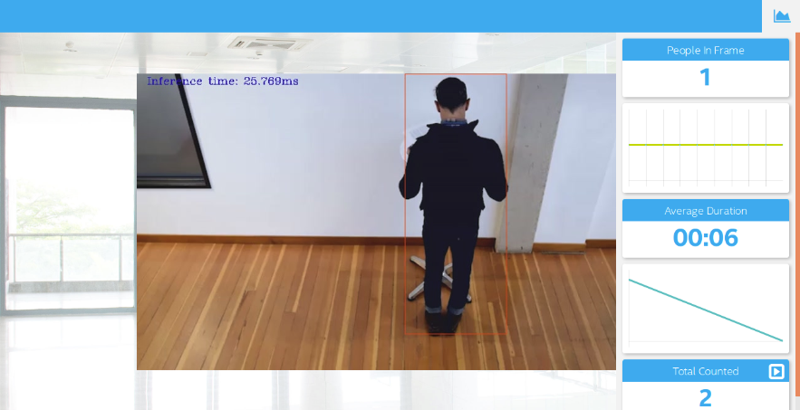
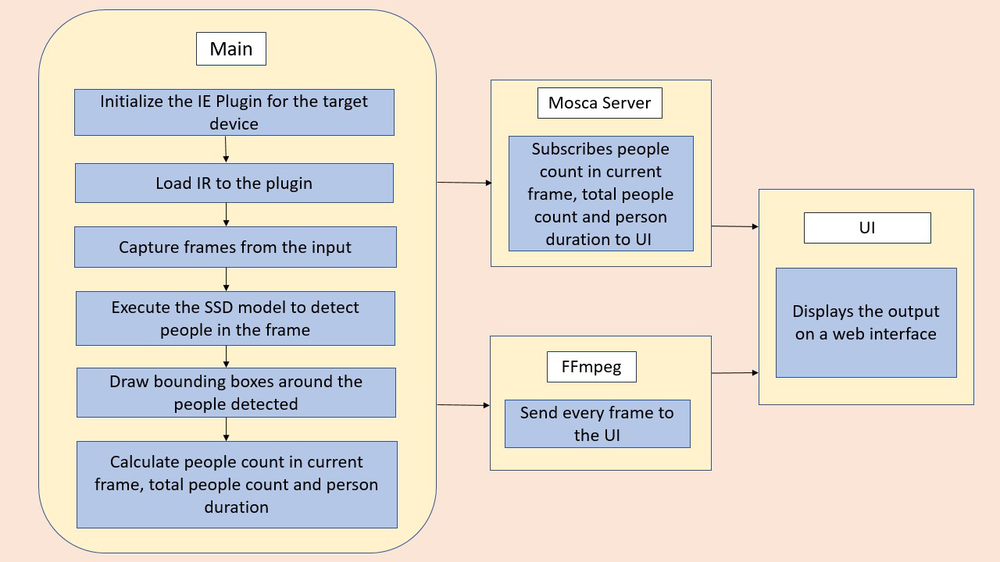
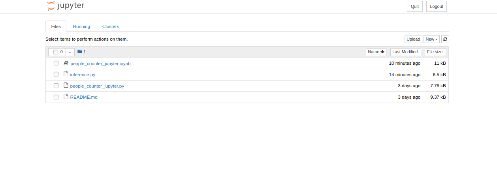
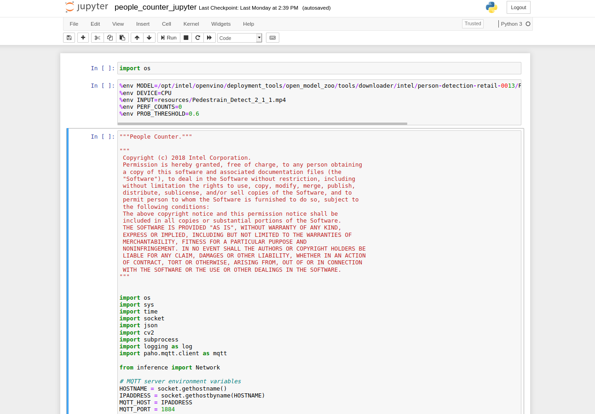

# People Counter


   | Details            |              |
|-----------------------|---------------|
| Target OS:            |  Ubuntu\* 18.04 LTS   |
| Programming Language: |  Python* 3.6 |
| Time to Complete:    |  45 min     |



## What it Does

The people counter application is one of a series of IoT reference implementations aimed at instructing users on how to develop a working solution for a particular problem. It demonstrates how to create a smart video IoT solution using Intel� hardware and software tools. This solution detects people in a designated area, providing the number of people in the frame, average duration of people in frame, and total count.

## Requirements

### Hardware

*  6th to 8th generation Intel� Core� processor with Iris� Pro graphics or Intel� HD Graphics.

### Software

*   [Ubuntu 18.04 LTS](http://releases.ubuntu.com/18.04/)

    **Note:** We recommend using a 4.14+ Linux kernel with this software. Run the following command to determine your kernel version:

     ```
     uname -a
     ```
*   Intel� Distribution of OpenVINO� toolkit 2020 R3 Release
*   OpenCL� Runtime Package
*   Node v6.17.1
*   Npm v3.10.10
*   MQTT Mosca\* server


### Which model to use

This application uses the [person-detection-retail-0013](https://docs.openvinotoolkit.org/2020.3/_models_intel_person_detection_retail_0013_description_person_detection_retail_0013.html) Intel® model, that can be accessed using the **model downloader**. The **model downloader** downloads the __.xml__ and __.bin__ files that will be used by the application.

### Install the dependencies

To install the dependencies of the RI and to download the **person-detection-retail-0013** Intel® model, run the following command:
```
cd <path_to_the_people-counter-python_directory>
./setup.sh
```

Make sure the npm and node versions are exact, using the commands given below:
```
node -v
```
The version should be **v6.17.1**

```
npm -v
```
The version should be **v3.10.10**

**Note**: If the Node and Npm versions are different, run the following commands:
```
sudo npm install -g n
sudo n 6.17.1
```
Note: After running the above commands, please open a new terminal to proceed further. Also, verify the node and npm versions from the new terminal.

## How it Works

The counter uses the Inference Engine included in the Intel� Distribution of OpenVINO� toolkit and the Intel� Deep Learning Deployment Toolkit. A pre-trained, SSD neural network detects people within a designated area by displaying a bounding box over them. It counts the number of people in the current frame, the duration that a person is in the frame (time elapsed between entering and exiting a frame) and the total count of people. It then sends the data to a local web server using the Paho MQTT Python package.

The DNN model used in this application is an Intel� optimized model that is part of the Intel� Distribution of OpenVINO� toolkit. You can find it here:

```/opt/intel/openvino/deployment_tools/open_model_zoo/tools/downloader/intel/person-detection-retail-0013/```



## Setup

### Get the code

Steps to clone the reference implementation:

```
sudo apt-get update && sudo apt-get install git
git clone https://github.com/intel-iot-devkit/people-counter-python.git 
```

### Install Intel� Distribution of OpenVINO� toolkit

Refer to [https://software.intel.com/en-us/articles/OpenVINO-Install-Linux](https://software.intel.com/en-us/articles/OpenVINO-Install-Linux) for more information about how to install and setup the Intel� Distribution of OpenVINO� toolkit.

You will need the OpenCL� Runtime Package if you plan to run inference on the GPU. It is not mandatory for CPU inference.

## Other Dependecies Installation
#### Install npm

Go to people-counter-python directory
```
cd <path_to_people-counter-python_directory>
```
* For mosca server:
   ```
   cd webservice/server
   npm install
   npm i jsonschema@1.2.6
   ```

* For Web server:
  ```
  cd ../ui
  npm install
  ```
### The Config File

The resources/config.json contains the path to the videos that will be used by the application.
The config.json file is of the form name/value pair, ```video: <path/to/video>```<br>

Example of the config.json file:<br>
```
{

    "inputs": [
	    {
            "video": "videos/video1.mp4"
        }
    ]
}
```

### Which Input video to use

The application works with any input video. Find sample videos for object detection [here](https://github.com/intel-iot-devkit/sample-videos/).

For first-use, we recommend using the [one-by-one-person-detection](https://github.com/intel-iot-devkit/sample-videos/blob/master/one-by-one-person-detection.mp4) video.The video is automatically downloaded to the `resources/` folder.
For example: <br>
The config.json would be:

```
{

    "inputs": [
	    {
            "video": "sample-videos/one-by-one-person-detection.mp4"
        }
    ]
}
```
To use any other video, specify the path in config.json file.

### Using the Camera instead of video

Replace the path/to/video in the _resources/config.json_  file with the camera ID, where the ID is taken from the video device (the number X in /dev/videoX).   

On Ubuntu, list all available video devices with the following command:

```
ls /dev/video*
```

For example, if the output of above command is /dev/video0, then config.json would be::

```
{

    "inputs": [
	    {
            "video": "0"
        }
    ]
}
```

## Run the application

There are three components need to be running in separate terminals for this application to work:

-   MQTT Mosca server
-   Node.js* Web server
-   FFmpeg server

Go to people-counter-python directory:
```
cd <path_to_people-counter-python_directory>
```
### Step 1 - Start the Mosca server

Ensure that no process is running at port address 3000 / 8000, using the following command:
```
sudo lsof -i:3000

```

Navigate to the `node-server` path and run the server using following commands:

```
cd webservice/server/node-server
node ./server.js
```

You should see the following message, if successful:
```
connected to ./db/data.db
Mosca server started.
```

### Step 2 - Start the GUI

Open new terminal and run below commands.
```
cd ../../ui
npm run dev
```

You should see the following message in the terminal.
```
webpack: Compiled successfully
```

### Step 3 - FFmpeg Server

Open new terminal and run the below commands.
```
cd ../..
sudo ffserver -f ./ffmpeg/server.conf
```

### Step 4 - Run the application on Jupyter*

1.Open a new terminal to run the application.

#### Setup the environment

You must configure the environment to use the Intel® Distribution of OpenVINO™ toolkit one time per session by running the following command:
```
source /opt/intel/openvino/bin/setupvars.sh
```
**Note**: This command needs to be executed only once in the terminal where the application will be executed. If the terminal is closed, the command needs to be executed again.

2. To open the Jupyter notebook, run the following command.

   ```
   jupyter notebook
   ```
    

3. Follow the below steps to run the code.

    *  Click on New button on the right side of the Jupyter window.

    *  Click on Python 3 option from the drop down list.

    *  In the first cell type **import os** and press **Shift+Enter** from the keyboard.

    * Export the below environment variables in the second cell of Jupyter and press Shift+Enter.

        %env MODEL=/opt/intel/openvino/deployment_tools/open_model_zoo/tools/downloader/intel/person-detection-retail-0013/FP32/person-detection-retail-0013.xml
        %env DEVICE=CPU
        %env PERF_COUNTS=0
        %env PROB_THRESHOLD=0.6

   * Copy the code from **people_counter_jupyter.py** and paste it in the next cell and press **Shift+Enter**.

   * To see output on a web based interface, open the link [http://localhost:8080](http://localhost:8080/) in a browser.

   * Shutdown the kernel by following below steps

        * Click on **kernel** menu and click **shutdown** option
        * Click on shutdown option

   * Alternatively, code can be run in the following way.   
       * Click on the " people_counter_jupyter.ipynb " file in the jupyter notebook window.
       * Click on the Kernel menu and then select Restart & Run All from the drop down list.    
       * Click on Restart and Run All Cells.
       * To see output on web based interface, open the link [http://localhost:8080](http://localhost:8080/) on browser.

    

 **NOTE:**

1. To run the application on **GPU**:
     * With the floating point precision 32 (FP32), change the **%env DEVICE = CPU** to **%env DEVICE = GPU**.
     * With the floating point precision 16 (FP16), change the environment variables as given below:<br>
        ```
        %env DEVICE = GPU
        %env MODEL=/opt/intel/openvino/deployment_tools/open_model_zoo/tools/downloader/intel/person-detection-retail-0013/FP32/person-detection-retail-0013.xml
        ```

2. To run the application on **Intel® Neural Compute Stick**:
      * Change the **%env DEVICE = CPU** to **%env DEVICE = MYRIAD**.  
      * The Intel® Neural Compute Stick can only run FP16 models. Hence, change the environment variable for the model as shown below. <br>
      **%env MODEL=/opt/intel/openvino/deployment_tools/open_model_zoo/tools/downloader/intel/person-detection-retail-0013/FP32/person-detection-retail-0013.xml**.<br>

3.  To print information about layers of the model, change **%env PERF_COUNTS = 0** to **%env PERF_COUNTS = 1**
