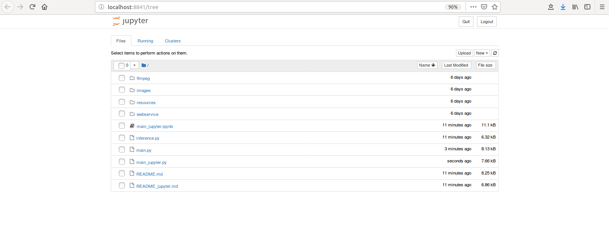
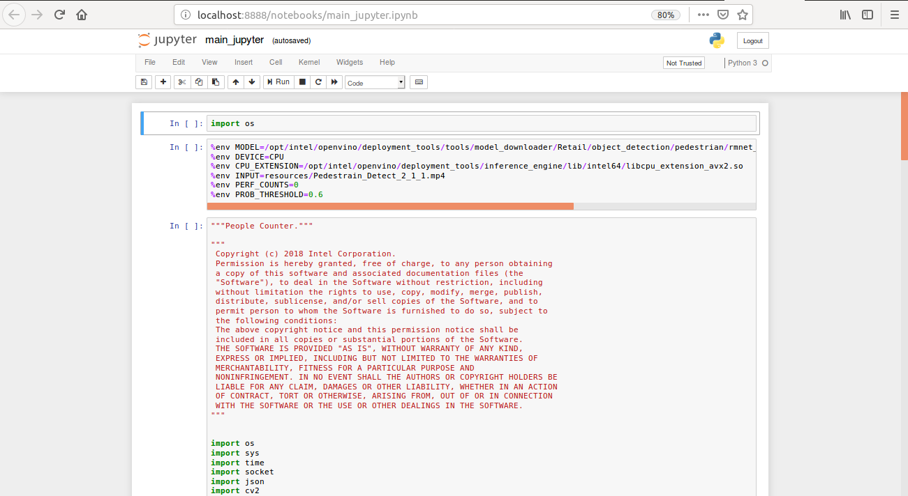

# People Counter


  | Details            |              |
|-----------------------|---------------|
| Target OS:            |  Ubuntu\* 16.04 LTS   |
| Programming Language: |  Python* 3.5 |
| Time to Complete:    |  45 min     |


## What it Does

The people counter application is one of a series of IoT reference implementations aimed at instructing users on how to develop a working solution for a particular problem. It demonstrates how to create a smart video IoT solution using Intel® hardware and software tools. This solution detects people in a designated area, providing the number of people in the frame, average duration of people in frame and total count.

## How it Works

The counter uses the Inference Engine included in the Intel® Distribution of OpenVINO™ toolkit and the Intel® Deep Learning Deployment Toolkit. A pre-trained, SSD neural network detects people within a designated area by displaying a bounding box over them. It counts the number of people in the current frame, the duration that a person is in the frame (time elapsed between entering and exiting a frame) and the total count of people. It then sends the data to a local web server using the Paho MQTT Python package.

The DNN model used in this application is an Intel® optimized model that is part of the Intel® Distribution of OpenVINO™ toolkit. You can find it here:

```/opt/intel/openvino/deployment_tools/intel_models/person-detection-retail-0013```


## Requirements

### Hardware

*  6th to 8th generation Intel® Core™ processor with Iris® Pro graphics or Intel® HD Graphics.

### Software

*   [Ubuntu 16.04 LTS](http://releases.ubuntu.com/16.04/)
    
    **Note:** We recommend using a 4.14+ Linux* kernel with this software. Run the following command to determine your kernel    version:
    
     ```
     uname -a
     ```

*   OpenCL™ Runtime Package
    
*   Intel® Distribution of OpenVINO™ toolkit 2019 R1 release
*   Node v6.17.1
*   Npm v3.10.10
*   MQTT Mosca\* server
        
## Setup

### Install Intel® Distribution of OpenVINO™ toolkit

Refer to https://software.intel.com/en-us/articles/OpenVINO-Install-Linux for more information about how to install and setup the Intel® Distribution of OpenVINO™ toolkit.

You will need the OpenCL™ Runtime Package if you plan to run inference on the GPU. It is not mandatory for CPU inference. 

### Install Nodejs and its depedencies

- This step is only required if the user previously used Chris Lea's Node.js PPA.

	```
	sudo add-apt-repository -y -r ppa:chris-lea/node.js
	sudo rm -f /etc/apt/sources.list.d/chris-lea-node_js-*.list
	sudo rm -f /etc/apt/sources.list.d/chris-lea-node_js-*.list.save
	```
- To install Nodejs and Npm, run the below commands:
	```
	curl -sSL https://deb.nodesource.com/gpgkey/nodesource.gpg.key | sudo apt-key add -
	VERSION=node_6.x
	DISTRO="$(lsb_release -s -c)"
	echo "deb https://deb.nodesource.com/$VERSION $DISTRO main" | sudo tee /etc/apt/sources.list.d/nodesource.list
	echo "deb-src https://deb.nodesource.com/$VERSION $DISTRO main" | sudo tee -a /etc/apt/sources.list.d/nodesource.list
	sudo apt-get update
	sudo apt-get install nodejs
	```

### Install the following dependencies

```
sudo apt update
sudo apt-get install python3-pip
pip3 install numpy
pip3 install paho-mqtt
sudo apt install libzmq3-dev libkrb5-dev
sudo apt install ffmpeg
pip3 install jupyter
```
### Install npm

There are three components that need to be running in separate terminals for this application to work:

-   MQTT Mosca server 
-   Node.js* Web server
-   FFmpeg server
     
Go to people-counter-python directory
```
cd <path_to_people-counter-python_directory>
```
* For mosca server:
   ```
   cd webservice/server
   npm install
   ```
* For Web server:
  ```
  cd ../ui
  npm install
  ```

  **Note:** If any configuration errors occur in mosca server or Web server while using **npm install**, use the below commands:
   ```
   sudo npm install npm -g 
   rm -rf node_modules
   npm cache clean
   npm config set registry "http://registry.npmjs.org"
   npm install
   ```
## Configure the application

### What model to use

By default, this application uses the **person-detection-retail-0013** Intel® model, that can be accessed using the **model downloader**. The **model downloader** downloads the __.xml__ and __.bin__ files that will be used by the application.

#### Download the __.xml__ and __.bin__ files

Go to the **model downloader** directory present inside Intel® Distribution of OpenVINO™ toolkit:

  ```
  cd /opt/intel/openvino/deployment_tools/tools/model_downloader
  ```

Specify which model to download with `--name`.
- To download the person-detection-retail-0013 model, run the following command:

  ```
  sudo ./downloader.py --name person-detection-retail-0013
  ```
- To optimize the model for FP16, run the following command:
   ```
   sudo ./downloader.py --name person-detection-retail-0013-fp16
   ```
The files will be downloaded inside the /Retail/object_detection/pedestrian/rmnet_ssd/0013/dldt directory.
## Run the application
Go to people-counter-python directory
```
cd <path_to_people-counter-python_directory>
```
### Step 1 - Start the Mosca server

```
cd webservice/server/node-server
node ./server.js
```

You should see the following message, if successful:
```
connected to ./db/data.db
Mosca server started.
```

### Step 2 - Start the GUI

Open a new terminal and run below commands.
```
cd ../../ui
npm run dev
```

You should see the following message in the terminal.
```
webpack: Compiled successfully
```

### Step 3 - FFmpeg Server

Open a new terminal and run the below commands.
```
cd ../..
sudo ffserver -f ./ffmpeg/server.conf
```


### Step 4 - Run the code on Jupyter*

1. Start a new terminal in the same directory and setup the Intel® Distribution of OpenVINO™ toolkit environment.

   ```
   source /opt/intel/openvino/bin/setupvars.sh -pyver 3.5
   ```
   **Note:**<br>
  Before running the application on the FPGA, program the AOCX (bitstream) file. Use the setup_env.sh script from [fpga_support_files.tgz](http://registrationcenter-download.intel.com/akdlm/irc_nas/12954/fpga_support_files.tgz) to set the environment variables.<br>
  For example:

   ```
   source /home/<user>/Downloads/fpga_support_files/setup_env.sh
   ```

    The bitstreams for HDDL-F can be found under the `/opt/intel/openvino/bitstreams/a10_vision_design_bitstreams` folder.<br><br>To program the bitstream use the below command:<br>
    ```
   aocl program acl0 /opt/intel/openvino/bitstreams/a10_vision_design_bitstreams/2019R1_PL1_FP11_RMNet.aocx
   ```

   For more information on programming the bitstreams, please refer to https://software.intel.com/en-us/articles/OpenVINO-Install-Linux-FPGA#inpage-nav-11<br><br>

2. To open the Jupyter notebook, run the following command.

   ```
   jupyter notebook
   ```
    
   
3. Follow the below steps to run the code.

    *  Click on New button on the right side of the Jupyter window.
    
    *  Click on Python 3 option from the drop down list.
    
    *  In the first cell type **import os** and press **Shift+Enter** from the keyboard.
    
    * Export the below environment variables in the second cell of Jupyter and press Shift+Enter.
    
        %env MODEL=/opt/intel/openvino/deployment_tools/tools/model_downloader/Retail/object_detection/pedestrian/rmnet_ssd/0013/dldt/person-detection-retail-0013.xml <br>
        %env DEVICE=CPU <br>
        %env CPU_EXTENSION=/opt/intel/openvino/deployment_tools/inference_engine/lib/intel64/libcpu_extension_avx2.so <br>
        %env INPUT=resources/Pedestrain_Detect_2_1_1.mp4 <br>
        %env PERF_COUNTS=0 <br>
        %env PROB_THRESHOLD=0.6 <br>
 
   * Copy the code from **main_jupyter.py** and paste it in the next cell and press **Shift+Enter**.
    
   * To see output on a web based interface, open the link [http://localhost:8080](http://localhost:8080/) in a browser.
       
   * Shutdown the kernel by following below steps
       
        * Click on **kernel** menu and click **shutdown** option
        * Click on shutdown option
    
   * Alternatively, code can be run in the following way.   
       * Click on the main_jupyter.ipynb file in the jupyter notebook window.
       * Click on the Kernel menu and then select Restart & Run All from the drop down list.    
       * Click on Restart and Run All Cells.
       * To see output on web based interface, open the link [http://localhost:8080](http://localhost:8080/) on                  browser.
   
    
 
 **NOTE:**

1. To run the application on **GPU**:
     * With the floating point precision 32 (FP32), change the **%env DEVICE = CPU** to **%env DEVICE = GPU**.
     * With the floating point precision 16 (FP16), change the environment variables as given below:<br>
        ```
        %env DEVICE = GPU
        %env MODEL=/opt/intel/openvino/deployment_tools/tools/model_downloader/Retail/object_detection/pedestrian/rmnet_ssd/0013/dldt/person-detection-retail-0013.xml
        ```
     * **CPU_EXTENSION** environment variable is not required.
   
2. To run the application on **Intel® Neural Compute Stick**: 
      * Change the **%env DEVICE = CPU** to **%env DEVICE = MYRIAD**.  
      * The Intel® Neural Compute Stick can only run FP16 models. Hence, change the environment variable for the model as shown below. <br>
      **%env MODEL=/opt/intel/openvino/deployment_tools/tools/model_downloader/Retail/object_detection/pedestrian/rmnet_ssd/0013/dldt/person-detection-retail-0013-fp16.xml**.<br>
      * **CPU_EXTENSION** environment variable is not required.
3. To run the application on **FPGA**:
      * Change the **%env DEVICE = CPU** to **%env DEVICE = HETERO:FPGA,CPU**.  
      * With the floating point precision 16 (FP16), change the path of the model in the environment variable as given below:<br>
      **%env MODEL=/opt/intel/openvino/deployment_tools/tools/model_downloader/Retail/object_detection/pedestrian/rmnet_ssd/0013/dldt/person-detection-retail-0013-fp16.xml**.<br>
      * **CPU_EXTENSION = /opt/intel/openvino/deployment_tools/inference_engine/lib/intel64/libcpu_extension_avx2.so**
4.  To run the application using **camera stream**, change the **%env INPUT_FILE = resources/Pedestrain_Detect_2_1_1.mp4** to  **%env INPUT_FILE = CAM**.<br>
           
5.  To print information about layers of the model, change **%env PERF_COUNTS = 0** to **%env PERF_COUNTS = 1**

